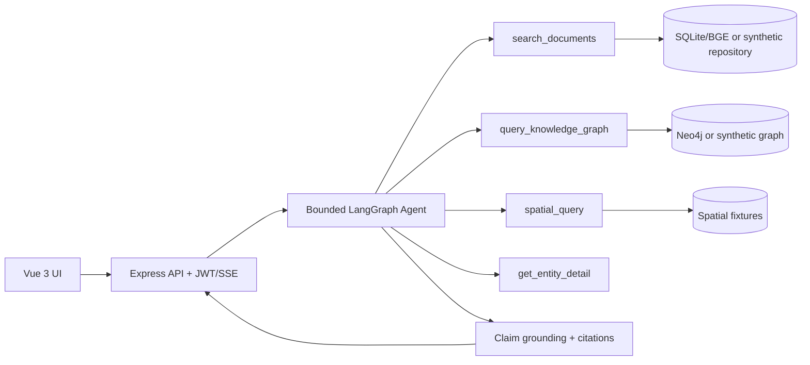

# Geological Knowledge Graph + RAG Investigation Agent

面向 AI 应用工程岗位的地质调查作品集项目。系统把专业地质文档检索、Neo4j 知识图谱、空间查询和实体详情封装为强类型工具，由有界 LangGraph Agent 规划并执行；每个事实结论经过引用与证据支持检查。

公开仓库默认运行完全虚构的合成演示，不包含真实地质报告、真实标题与片段、精确坐标、数据库或 API Key。

## Quick start

环境要求：Node.js 22.18+（小于 23）、Python 3.10、Windows PowerShell。

```powershell
npm run demo
```

命令会生成确定性合成数据、按需安装依赖、构建前后端、启动服务，并自动完成健康检查、登录与 Q&A 冒烟。打开 `http://127.0.0.1:5173`，使用 `user / user123` 登录。停止服务：

```powershell
npm run demo:stop
```

## Architecture



应用状态单独保存在 `backend/data/app.db`：会话、消息、最近 6 轮、滚动摘要、活动实体、Agent 运行和脱敏工具记录。真实检索数据库不用于保存用户状态，也不记录隐藏思维过程。

## Tool execution sequence

1. 问题理解：识别地质问答、实体、空间分析、区域比较、闲聊或需澄清意图。
2. 上下文补全：结合最近 6 轮、滚动摘要和活动实体改写追问。
3. 任务规划：生成简短声明式步骤，最多选择 3 个工具。
4. 工具执行：独立工具可并行；单工具 10 秒、整轮 60 秒超时。
5. 证据整理：文档 Top20 可选 BGE 重排，再去重和限制单文档占比，保留 Top5。
6. 回答校验：逐句检查支持度，只交付 `[D{id}-P{page}]` 或 `[KG{id}]` 引用；证据不足时拒答。

SSE 保持 `meta -> chunk -> done` 兼容流程，并增加 `plan`、`tool_start`、`tool_end` 事件。工具时间线只包含工具名、参数摘要、状态、耗时和证据数量。

## Multi-turn examples

所有名称与坐标均为虚构演示数据。

**示例一：实体追问**

- 用户：`Introduce Synthetic Aurora Deposit 1.`
- 用户：`Which structure controls it?`
- 系统：从活动实体解析 `it`，调用图谱工具并引用合成 KG 路径。

**示例二：区域比较**

- 用户：`Show Synthetic Borealis Deposit 2.`
- 用户：`Compare it with Synthetic Cirrus Deposit 3.`
- 系统：保留前一实体，组合图谱与空间工具，明确坐标为 `isMock`。

**示例三：无证据拒答**

- 用户：`What evidence describes Synthetic Ember Deposit 5?`
- 用户：`Give its verified reserve tonnage.`
- 系统：第二问没有储量证据，删除不受支持的断言并拒绝给出数值。

## Evaluation

公开评测包含 80 道合成单轮题（60 道有证据、20 道拒答题）和 20 组三轮对话。development/test 使用不同的实体、文档、构造与区域池。Direct、RAG、KG、Hybrid、Agent 由私有适配器执行，公开结果格式只允许派生标签、计数、引用 ID 与延迟。

| 指标 | 验收阈值 | 当前公开状态 |
|---|---:|---|
| Recall@5 | >= 0.80 | 合成评测管线已验证 |
| MRR@10 | >= 0.70 | 合成评测管线已验证 |
| 意图 / 工具准确率 | >= 0.90 | 合成评测管线已验证 |
| 实体链接 Top-1 | >= 0.85 | 合成评测管线已验证 |
| 引用精确率 | >= 0.90 | 合成评测管线已验证 |
| 拒答错误作答率 | <= 0.10 | 合成评测管线已验证 |
| 多轮任务成功率 | >= 0.80 | 合成评测管线已验证 |
| 不支持断言率 | <= 0.35 | 合成评测管线已验证 |

`backend/evaluation/public/report.test.md` 的满分结果只证明 Schema、指标计算和报告生成能按确定性输入工作，不是模型效果证明。自动裁判仅作辅助，human blind review 当前仍为 `pending`；在盲审完成前不对外宣称达到上述性能。

## Synthetic snapshot

`demo/generated/manifest.json` 由生成器自动产出。目前公开演示快照为 6 篇虚构文档、6 个切片、30 个节点、24 条关系和 12 个空间要素。数字来自清单，不手写绑定真实数据规模。

```powershell
python demo/generate_synthetic_demo.py --output demo/generated
```

## Dify workflow

`demo/dify/geology-agent-workflow.yml` 是可选客户端，不是运行依赖。导入 Dify 后设置 `backend_base_url`，再通过后端 `/api/auth/login` 获取短期 JWT 并填入私密环境变量 `backend_token`。DSL 不包含任何凭据。

## Privacy

- 不提交真实 PDF、标题、文本片段、数据库、原始回答、精确私有坐标或课程材料。
- 不提交 DeepSeek、高德、通义或 Neo4j 凭据；`.env` 和 `ml-service/config.py` 被忽略。
- 公开实体、文档、图关系与坐标均带 `synthetic` / `isMock` 标记。
- 工具日志不保存 chain-of-thought，只保存可审计元数据。
- 提交前运行 `npm run verify`，其中包含密钥与私有路径扫描。

## Limitations

- 当前核心是单个有界 Agent，不宣称为多智能体系统；Dify 仅展示外部工作流编排。
- BGE reranker 默认关闭，模型不可用时使用确定性顺序和启发式多样化。
- 规则式 claim grounding 以保守拒答为优先，可能拒绝语义正确但措辞差异较大的结论。
- 公开数据规模很小，只适合复现产品链路，不代表真实地质调查质量。
- 最终模型指标尚未完成匿名 human blind review。

## Troubleshooting

- `ERR_CONNECTION_REFUSED`：确认 `npm run demo` 已输出 smoke check passed，并检查 `.demo-runtime/*.error.log`。
- 端口 3000 或 5173 被占用：先运行 `npm run demo:stop`；若仍占用，关闭对应本地服务。
- Node ABI 错误：使用 `.nvmrc` 指定的 Node 22，并重新执行 `npm ci --prefix backend`。
- 页面没有地图底图：公开演示不需要高德 Key，仍会显示合成空间要素的文字与图层降级。
- 想连接真实服务：复制 `.env.example`，自行配置私有环境；不要把配置文件加入 Git。

## Resume guidance

在人工评测完成前，建议使用以下口径：

> Built a traceable geological investigation Agent for professional geological documents, integrating RAG, knowledge-graph and spatial tools with multi-turn entity memory, claim-level citations, failure fallbacks and a reproducible evaluation framework.

中文可写为“面向专业地质文档构建可追踪的地质调查 Agent，完成多轮实体记忆、RAG/KG/空间工具调用、逐条引用、故障降级与可复现评测框架”。真实文档数、切片数、向量维度和图谱规模只能从本地生成的数据快照读取；human blind review 完成前，不把合成报告或初步自动评测描述为效果证明。

## Development verification

```powershell
npm run verify
```

该命令执行后端测试与类型检查、前端全部测试与类型检查、Python 单元测试以及敏感信息扫描。运行真实链路需要按 `AGENTS.md` 启动 Flask 与 Neo4j；公开合成演示不需要它们。
